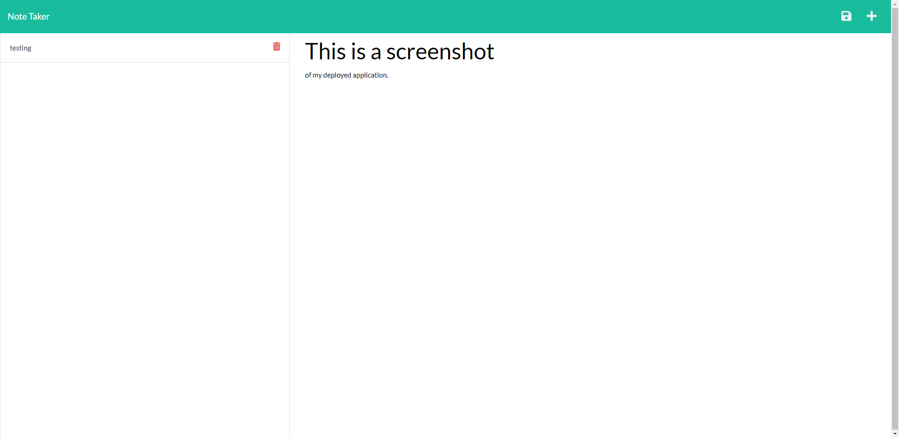

# Note-taker

 <br> [MIT](https://opensource.org/licenses/MIT)

1.[ Description. ](#desc)
<br>
2.[ Installation. ](#inst)
<br>
3.[ Usage. ](#use)
<br>
4.[ Contributing. ](#contr)
<br>
5.[ Testing. ](#test)
<br>
6.[ Github. ](#git)
<br>
7.[ Contact Me.](#conta)
<br>

<a id="desc"></a>
## 1.Description
This application is used to write and save notes. It uses an Express.js back end. It saves and retrieves note data from a JSON file. Technologies used for this application were NODE, JAVASCRIPT, EXPRESS, and deployed through HEROKU.

<a id="inst"></a>
## 2.Installation
This is a live deployed website on Heroku. If you want to use this application locally you can clone the repo.After you have node installed you can run "npm i" in console.Then "npm i express". Then "node server" in console and it will run locally.

<a id="use"></a>
## 3.Usage

OPEN USE

<a id="contr"></a>
## 4.Contributing

OPEN CONTRIBUTION

<a id="test"></a>
## 5.Testing
```

```
<a id="git"></a>
## 6.Github

[GitHub](https://github.com/veidul)

<a id="conta"></a>
## 7.Contact Me
Ludie Lambright <br>
Email: 
ludiefletcher@gmail.com
<br>
---------
[Live Website](https://dashboard.heroku.com/apps/note-taker-veidul)<br>
<br>
[GitHub Repository](https://github.com/veidul/Note-taker)<br><br>

